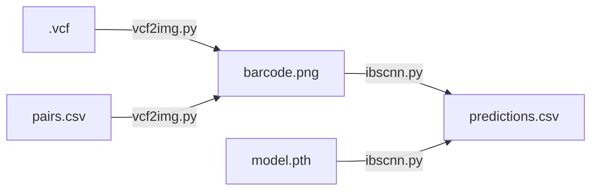

# IBS-CNN Pipeline

A complete, end-to-end workflow that turns **VCF files** into **kinship predictions** using computer vision.

1. [**vcf2img.py**](#vcf2imgpy) – converts VCF + sample-pair list into chromosome-wide barcode images.  
2. [**ibscnn.py**](#ibscnnpy) – classifies the generated images with a pre-trained CNN based on Identity-by-State (IBS) theory.

---

## Quick Start

```bash
# 1. unzip example 7z files in ./example

# 2. generate IBS barcode images
python vcf2img.py --vcf(-v) ./example/1kg_un/un.vcf --pair(-p) ./example/1kg_un/un.csv --output(-o) demo_img

# 3. run IBS-CNN
python ibscnn.py --image(-i) ./example/1kg_simulated_pedigree --model(-m) ./model/128x512_LongBarcodeCNN.pth --output(-o) demo_pred
```

---

## <a id="vcf2imgpy"></a> `vcf2img.py`

Generate IBS barcode heatmaps from a VCF and a sample-pair list.

### Installation of dependencies

```bash
pip install allel pandas numpy matplotlib seaborn
```

### Usage

```bash
python vcf2img.py -v <vcf_path> -p <pair_path> [-o <out_dir>]
```

| Flag | Default | Description |
|------|---------|-------------|
| `-v`, `--vcf` | – | Multi-sample high-density SNP VCF (chr 1–22) |
| `-p`, `--pair` | – | CSV with columns `Sample1`, `Sample2`, `label` |
| `-o`, `--out` | `./input` | Output directory for PNG files |


### Output

One PNG per pair:  
`<Sample1>_<Sample2>-<label>.png`  
- Size: 2 × 100 inches (width × height)  
- DPI: 150  
- Color encoding:  
  - 🔴 `00` – discordant at both alleles  
  - 🟢 `01` – discordant at second allele  
  - 🔵 `10` – discordant at first allele  
  - 🟡 `11` – identical at both alleles  
- :boom::boom::boom: Warning: `<label>` name must exactly match the table of **Kinship Labels** below :boom::boom::boom:
---

## <a id="ibscnnpy"></a> `ibscnn.py`

IBS-CNN: classify barcode images into seven relatedness categories.

### Installation of dependencies

```bash
pip install torch torchvision pillow
```

### Usage

```bash
python ibscnn.py -i <image_dir> -m <model.pth> [-o <output.csv>]
```

| Flag | Default | Description |
|------|---------|-------------|
| `-i`, `--image` | – | Directory containing PNG barcode images |
| `-m`, `--model` | – | Trained IBS-CNN checkpoint (`.pth`) |
| `-o`, `--output` | `predictions.csv` | CSV with predictions & probabilities |

### Kinship Labels

| Label | Meaning |
|-------|---------|
| `FS`  | Full siblings |
| `UN`  | Unrelated |
| `PO`  | Parent–offspring |
| `2nd` | 2nd-degree |
| `3rd` | 3rd-degree |
| `4th` | 4th-degree |
| `5th` | 5th-degree |
---

## Pipeline Overview



---

## Notes

- GPU is auto-detected; falls back to CPU.  
- Images that fail to load are logged with label `ERROR`.  
- Both scripts are fully self-contained—no extra training code needed for inference.
